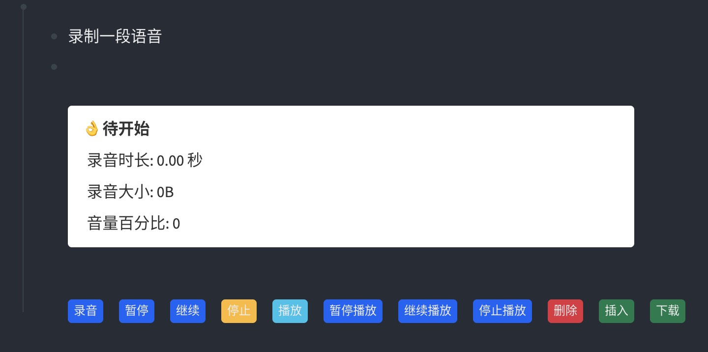

- # loseq-audio-memo
	- 一个能够在 logseq 中录音并插入文档中的插件
	- 
- ## 功能
	- 录音
	- 播放
	- 下载
	- 插入至文档
- ## 待办
	- [ ] 录音和播放波形图（声音可视化）
	- [ ] 语音转文字
	- [ ] 支持其他格式的音频文件（比如： mp3）
	- [ ] 双语界面（目前仅支持中文）
	- [ ] 支持插入文档前重命名
- ## 演示
  - 
  - 
- ## 鸣谢
	- 实现录音功能使用了这个库: https://github.com/2fps/recorder @[2fps](https://github.com/2fps)
- ## 许可证