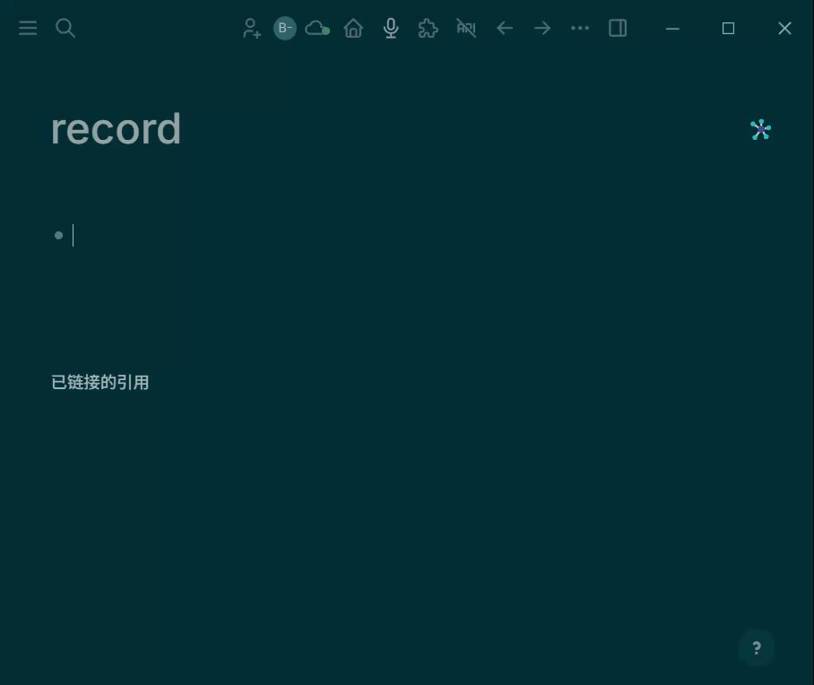

# Logseq Audio Memo

A voice recording plugin for [Logseq](https://logseq.com). Record, preview, and insert audio memos directly into your notes.

> Supports both **Logseq DB** and **Logseq OG**.

---

## 📖 Usage

1. **Start Recording**:
   - Type `/record` in any block, or
   - Right-click a block and click `Audio Memo: Record here`, or
   - Click the microphone icon on the top toolbar, or
   - Search for `Audio Memo: Record Audio` in the Command Palette (`Ctrl+K` / `Cmd+K`).
2. **Control During Recording**:
   - Click `Pause` to pause, and `Resume` to continue.
   - Click `Done` to finish recording.
   - Click `✕` to discard.
3. **Insert or Export**:
   - Click `Play` to listen to the preview.
   - Click `Insert` to save the WAV file to `assets/` and embed it into your note.
   - Click `Download` to download the WAV file directly to your computer.

---

## 💖 Acknowledgements

- Audio recording powered by [js-audio-recorder](https://github.com/2fps/recorder) .

---

## 📄 License

[MIT License](LICENSE)
